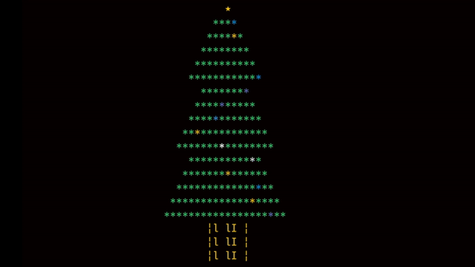

# CHRISTMAS-TREE-CLI


# How to run

```bash
$ git clone https://github.com/SeiwonPark/christmas-tree-cli.git
$ python main.py
```

# Usage
```bash
$ python main.py --help
usage: main.py [-h] [-b BRANCH] [-w WIDTH]

optional arguments:
    -h, --help            show this help message and exit
    -b BRANCH, --branch BRANCH
        Tree height. It will define the number of branches.
        Tree height ≥ 1
    -w WIDTH, --width WIDTH
        Tree width. It will define the number of leaves in its
        branch. Tree width ≥ 5
```

# License
[MIT](./LICENSE)